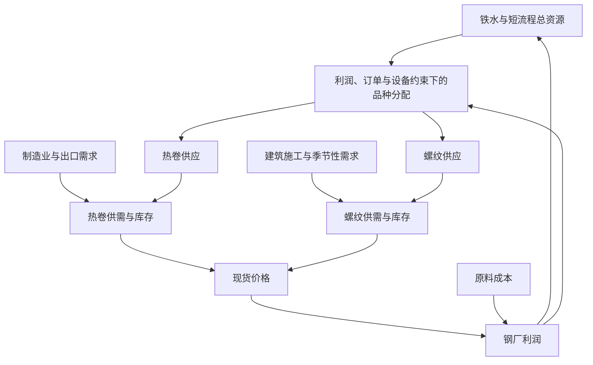

# A02 产业因果模型

状态：因果结构草案｜依据：手册第5节、第21节。以下箭头表达待验证的传导路径，不代表稳定系数或确定时滞。

## 研究顺序

1. [A02.1 总钢材资源池](产业因果专题/A02.1_总钢材资源池.md)
2. [A02.2 卷螺品种分配](产业因果专题/A02.2_卷螺品种分配.md)
3. [A02.3 热卷供需系统](产业因果专题/A02.3_热卷供需系统.md)
4. [A02.4 螺纹供需系统](产业因果专题/A02.4_螺纹供需系统.md)
5. [A02.5 跨品种反馈](产业因果专题/A02.5_跨品种反馈.md)
6. [A02.6 利润生产库存闭环](产业因果专题/A02.6_利润生产库存闭环.md)

## 所有因果边必须补齐

驱动变量、结果变量、方向条件、经济机制、替代解释、反例、观测频率、可用时间、候选时滞、验证样本与结论版本。

供需与库存必须使用相同样本、品种、地域和期间。表观消费是由供给与库存反推的代理指标，不等于独立观测的终端需求；不能再把它和库存当作两份独立证据加权。
