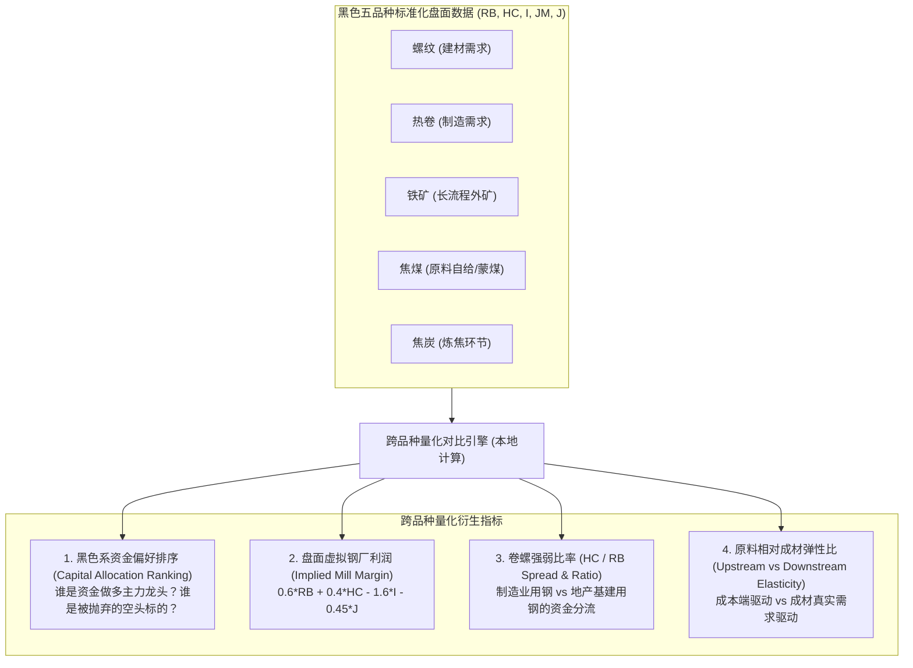

# A05.2 黑色五品种期货资金投机度与量化对比规范

**当前阶段**：阶段 A｜量化架构与衍生指标规范  
**文件定位**：确立螺纹钢、热卷、铁矿石、焦煤、焦炭五大品种期货端高频量化指标、资金投机度度量及跨品种对比分析体系  
**关联文件**：`阶段A/A01_策略总纲.md`、`阶段A/A04_状态变量手册.md`、`阶段A/A05.1_模型量化输出与指标设计规范.md`、`outputs/阶段A_框架初版/A03_数据地图.xlsx`  

---

## 一、 战略定位与核心价值

在商品产业量化体系中，**期货端数据是质量最高、时滞最低、标准化最强、摩擦最小的数据源**。将黑色系五大核心品种（**螺纹钢 RB、热轧卷板 HC、铁矿石 I、焦煤 JM、焦炭 J**）的期货盘面资金与投机度全面指标化，具备两大战略价值：

1. **基本面数据真空期的“降级支撑导航（Fallback Navigator）”**：
   - 产业基本面数据多为周频（如五大材周产销存周四发布、铁水高炉周五发布）或月频（国家统计局数据）。在周初或节假日基本面未更新的“数据真空期”，期货盘面的成交量、持仓量与沉淀资金行为能提供**每日 15:30 零时滞的客观微观博弈信息**。
2. **跨品种多空博弈与资金意图的“敏捷雷达（Speculative Flow Radar）”**：
   - 黑色产业链是一个强相关的整体，机构资金发动一波大行情，往往选择**弹性最大或矛盾最锋利的品种作为突破口**（如“买矿空螺”压榨钢厂利润、或“多卷空螺”交易制造业强于地产）。
   - 单看螺纹一个品种会一叶障目；将五大品种横向标准化对比，能一眼洞穿**主力资金是在推升成本、做空利润，还是全板块单边逼仓**。

---

## 二、 五大品种底层输入标准化矩阵（每日 15:30 更新）

覆盖上期所（SHFE）与大商所（DCE）五大核心品种的主力连续合约（Active Contract）：

| 品种代码 | 品种名称 | 交易所 | 主力收盘价代码 | 主力成交量代码 | 主力持仓量代码 | 交易所仓单代码 | 交易单位与保证金基准 |
| :--- | :--- | :--- | :--- | :--- | :--- | :--- | :--- |
| **RB** | 螺纹钢 | 上期所 | `M0067416` | `M0096585` | `M0096618` | `S0140228` | 10吨/手，约8%~10% |
| **HC** | 热轧卷板 | 上期所 | `S0203425` | `M0096586` | `M0096619` | `S0240409` | 10吨/手，约8%~10% |
| **I** | 铁矿石 | 大商所 | `S0181404` | `M0096587` | `M0096620` | `S0240398` | 100吨/手，约11%~13% |
| **JM** | 焦煤 | 大商所 | `S0181379` | `M0096588` | `M0096621` | `S0240400` | 60吨/手，约12%~15% |
| **J** | 焦炭 | 大商所 | `S0181363` | `M0096589` | `M0096622` | `S0181371` | 100吨/手，约12%~15% |

> 📌 **数据获取与成本优势**：
> 以上数据由交易所官方网站每日收盘后直接公开披露，亦可通过本地 Python 工具零成本获取，**完全不消耗任何商业 API 积分**，具备极高的稳定性和零维护成本。

---

## 三、 单品种资金投机度衍生量化指标（每日纯本地计算）

针对 5 个品种中的任意品种 $k \in \{\text{RB, HC, I, JM, J}\}$，每日计算以下 5 个标准度量：

### 1. 成交持仓比（Volume-to-Open-Interest, $VOI_k$）
$$VOI_{k, t} = \frac{\text{Volume}_{k, t}}{\text{OpenInterest}_{k, t}}$$
- **经济含义**：衡量日内游资与高频投机资金的活跃度与换手狂热度。
- **阈值基准（以螺纹为例）**：
  - $VOI < 0.6$：交投清淡，处于窄幅整理或休眠期；
  - $0.7 \le VOI \le 1.2$：正常健康换手区间；
  - $VOI > 1.5$：**极度过热**，短线筹码剧烈换手，通常对应波段脉冲的极值点。

### 2. 沉淀保证金资金与净资金流向（Capital Inflow, $\Delta Cap_k$）
$$\text{MarginCapital}_{k, t} = \text{OpenInterest}_{k, t} \times \text{SettlePrice}_{k, t} \times \text{Multiplier}_k \times \text{MarginRatio}_k$$
$$\Delta Cap_{k, t} = \text{MarginCapital}_{k, t} - \text{MarginCapital}_{k, t-1}$$
- **经济含义**：度量真实新增外部资金是在大举进场沉淀，还是资金在获利离场出逃。

### 3. 量价仓四维资金行为模式分类（OI-Price Regime）
根据价格变化 $\Delta P$、持仓变化 $\Delta OI$ 与成交量变化 $\Delta V$ 每日自动打标：

| 模式名称 | 价格 $\Delta P$ | 持仓 $\Delta OI$ | 成交量 $V$ | 资金博弈性质与量化含义 |
| :--- | :--- | :--- | :--- | :--- |
| **增仓推升（Long Accumulation）** | 大涨 | 大幅增加 | 放大 | 新多头主动进攻，增量真金白银推升，行情具备持续性 |
| **减仓反弹（Short Covering）** | 上涨 | 显著减少 | 萎缩 | **空头止损离场引发的被动踩踏**，无新多承接，通常是反弹尾声 |
| **增仓下挫（Short Accumulation）** | 大跌 | 大幅增加 | 放大 | 新空头主动重击打压，跌势迅猛 |
| **减仓下跌（Long Liquidation）** | 下跌 | 显著减少 | 萎缩 | 多头多翻空砍仓止损，逢低买盘未进场 |
| **增仓滞涨（Bull Trap / Exhaustion）** | 窄幅微涨 | 暴增 | 巨量 | 盘面遇到沉重抛压，多头资金子弹打满但推不动，变盘在即 |

### 4. 主力前 20 席位多空净头寸偏度与集中度（Top 20 Net Bias & Concentration Skew）

#### (1) 主力多空净头寸偏度（$TNB_{k, t}$）
$$TNB_{k, t} = \frac{\sum_{i=1}^{20} \text{LongPos}_{i, t} - \sum_{i=1}^{20} \text{ShortPos}_{i, t}}{\text{OpenInterest}_{k, t}}$$
- 跟踪主流机构主力席位（如中信、国泰、永安、东证等）的净持仓倾向，量化机构头寸拥挤度。
- 当 $Z_{TNB} > +2\sigma$ 时预警机构多头拥挤，禁止追多；当 $Z_{TNB} < -2\sigma$ 时预警空头拥挤。

#### (2) 多空持仓集中度偏度（Concentration Skew, $CS_{k, t}$）
$$CR_{\text{Long}, 20} = \frac{\sum_{i=1}^{20} \text{LongPos}_i}{\text{OpenInterest}_k}, \quad CR_{\text{Short}, 20} = \frac{\sum_{i=1}^{20} \text{ShortPos}_i}{\text{OpenInterest}_k}$$
$$CS_{k, t} = CR_{\text{Long}, 20} - CR_{\text{Short}, 20}$$
- $CS \gg 0$：多头主力高度寡头化集结，空头筹码极度分散在散户与中小游资，极易引发逼仓式单边拉升；
- $CS \ll 0$：空头主力高度集中打压，多头呈散沙踩踏。

#### (3) 席位画像分群动向剪刀差（Industry Hedger vs Speculative Momentum）
依托 `config/broker_classification.json` 将会员席位解构为三大阵营：
- **产业套保特征群（$\text{Group}_{\text{Ind}}$）**：永安、浙商、银河、中粮、南华、一德等，衡量现货锁定利润与期现套保抛压；
- **投机量化特征群（$\text{Group}_{\text{Spec}}$）**：东证、华泰、广发、海通、申万等，衡量CTA动量追涨杀跌与高频资金活跃度；
- **大型综合头部（$\text{Group}_{\text{Comp}}$）**：中信、国泰君安，客户结构多元，重在监测多空方向翻转。
- **研判场景**：盘面大涨但产业席位净空单暴增、量化席位在推多 $\rightarrow$ 产业大举卖出套保锁定利润，现货并不买账，警惕纯资金博弈见顶。

### 5. 期限结构月差斜率（Term Structure / Roll Yield, $TS_k$）
$$TS_{k, t} = \frac{P_{\text{near}, t} - P_{\text{deferred}, t}}{P_{\text{near}, t}} \times \frac{365}{\Delta \text{Days}}$$
- **Backwardation（近高远低）**：反映微观现货极度紧缺，仓单逼近；
- **Contango（近低远高）**：反映即期供给过剩，库存积压。

---

## 四、 跨品种横向对比与资金流向特征（Cross-Commodity Radar）

将 5 个品种置于同一标准化坐标系下，每日提炼 4 个板块级宏观资金指标：

### 1. 资金集中度与进攻龙头识别（Capital Preference Ranking）
- 计算 5 个品种每日新增沉淀资金的占比分布：
  $$\text{Share}_{\Delta Cap, k} = \frac{|\Delta Cap_k|}{\sum_{j=1}^{5} |\Delta Cap_j|}$$
- 找出资金净流入最大、增仓斜率最陡峭的品种，标记为**当前主线龙头（Market Leader）**。

### 2. 盘面虚拟钢厂利润（Implied Mill Margin, $IMM_t$）
- **公式**：
  $$IMM_t = 0.6 \times P_{\text{RB}, t} + 0.4 \times P_{\text{HC}, t} - 1.6 \times P_{\text{I}, t} - 0.45 \times P_{\text{J}, t}$$
- **量化经济含义**：
  - 盘面虚拟利润反映期货市场资金对未来钢企盈利的博弈预期；
  - $IMM_t$ 处于历史极高位：资金极度乐观，必然招致铁矿双焦资金跟进“做多原料、做空钢厂利润”；
  - $IMM_t$ 处于历史极低位（如盘面亏损超 200 元）：钢厂减产预期打满，成材下行阻力极大。

### 3. 盘面卷螺差与比价（HC/RB Spread）
$$\text{Spread}_{\text{HC-RB}, t} = P_{\text{HC}, t} - P_{\text{RB}, t}$$
- 制造业景气与建筑业景气的金融资金即时投票机。

### 4. 原料与成材资金强弱剪刀差（Raw Materials vs Steel Bias）
$$\text{Bias}_{\text{Raw-Steel}, t} = \frac{1}{3}(R_{\text{I}, t} + R_{\text{JM}, t} + R_{\text{J}, t}) - \frac{1}{2}(R_{\text{RB}, t} + R_{\text{HC}, t})$$
- 当剪刀差大幅为正时，说明当前行情完全由**上游原料资金抱团推升**，成材处于被动跟涨的脆弱状态。

---

## 五、 基本面数据缺失时的“降级运行规则（Fallback Rules）”

当处于周初、节假日或基本面关键数据暂未公布的“信息真空期”时，系统启动**【期货资金盘面导航模式】**：

1. **多头攻击态势确认**：
   - 黑色板块 5 个品种中，至少 4 个品种呈现 $\Delta P > 0$ 且 $\Delta OI > 0$（全板块增仓上攻）；
   - 资金偏好龙头明确为铁矿或螺纹，沉淀资金净流入破近 20 日均值 $+1.5\sigma$；
   - **系统判定**：`Regime = 资金主动进攻型多头（Speculative Bull Momentum）`，即使缺乏当周库存数据，也绝不逆势做空。
2. **多头衰竭与见顶预警**：
   - 价格创新高，但五大品种总体持仓量 $\sum OI$ 出现连续 2 日以上断崖式减少（$\Delta OI \ll 0$）；
   - $VOI$ 换手率从高位大幅回落；
   - **系统判定**：`Regime = 空头踩踏衰减期（Exhaustion Rally）`，提示资金动能衰退，随时等待基本面做空扳机触发。
3. **空头防守与流动性冰点**：
   - 全品种沉淀资金持续流出，成交量萎缩至近 60 日均值以下，各品种月差平水；
   - **系统判定**：`Regime = 流动性收缩观望期（Liquidity Vacuum）`，系统强制空仓观望。

---

## 六、 总结与数据接入方案

1. **五品种盘面基础数据接入**：
   - 螺纹、热卷、铁矿、焦煤、焦炭 5 大品种主力收盘价、成交量、持仓量、交易所仓单（`F06-F22`）以及盘面虚拟钢厂利润(IMM)、卷螺差、五品种VOI投机度矩阵、原料成材资金剪刀差（`F23-F26`）已完整登记入 `A03_数据地图.xlsx`（行 139 至 159）。
2. **天勤量化 (TqSdk) 会员席位龙虎榜采集管道**：
   - **执行脚本**：[scripts/fetch_futures_ranking.py](file:///home/hw/项目/钢材产业系统量化模型/scripts/fetch_futures_ranking.py)
   - **数据源与频率**：基于本地已安装的 `tqsdk 3.10.2`，调用 `api.query_symbol_ranking()` 接口，在交易日 **18:30~19:00** 自动拉取 5 大品种当日主力合约前 20 席位成交量、多头持仓、空头持仓及日度变动。
   - **原始事实层**：规整存入 `数据/原始/期货会员持仓/{YYYYMMDD}_黑色五品种席位持仓原始明细.csv`，保留完整 `observation_id`、`available_date` 与 `quality_flag`。
   - **特征加工层**：自动计算主力多空净头寸偏度（$TNB$）、多空集中度偏度（$CS$）以及产业 vs 投机席位净变动（$Group_{Ind}$ vs $Group_{Spec}$），追加至 [数据/加工/加工指标.csv](file:///home/hw/项目/钢材产业系统量化模型/数据/加工/加工指标.csv)。
3. **席位画像分类维护**：
   - 在 [config/broker_classification.json](file:///home/hw/项目/钢材产业系统量化模型/config/broker_classification.json) 中维护产业套保席位、量化投机席位与综合席位白名单，保持动态可审计与可扩充。
4. **安全与凭据管理**：
   - 凭据配置模板见 [config/tqsdk_config.example.json](file:///home/hw/项目/钢材产业系统量化模型/config/tqsdk_config.example.json)，真实凭据 `config/tqsdk_config.json` 及环境变量已全量加入 `.gitignore` 保护，绝不泄露到代码库。
