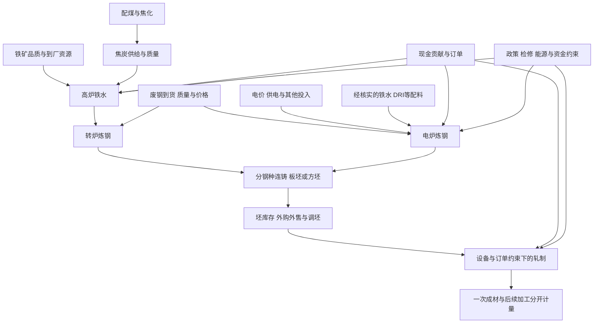

# A02.1 总钢材资源池

状态：阶段 A 设计审定稿；无历史因果验证、无可交易参数｜设计日期：2026-09-20（Asia/Shanghai）｜任务：T002 设计部分、T-ARCH-003

本页回答“在工艺、设备、原料、订单和政策约束下，有多少资源能进入成材生产”。先识别总量，再由 [A02.2](A02.2_卷螺品种分配.md) 解释品种分配。本次增加计量边界、可证伪机制与研究契约；来源、合成反例和限制见 [审查记录](../../研究/架构审查/03_产业因果与反例审定.md)。

## 1. 资源池分层：数量不能跨层相加

| 层次 | 定义与允许用途 | 禁止的替代或加总 |
|---|---|---|
| 高炉铁水 | 高炉产出；样本铁水和全国生铁分别保留范围，是后续炼钢投入和矿焦消耗条件变量 | 不是全国粗钢或螺纹供应；与粗钢相加重复计入上游投入 |
| 粗钢 | 完成冶炼而未经塑性加工的钢；按统一制度区分 BOF、EAF 和其他路径 | 全国粗钢已覆盖其统计范围内各工艺，不能再叠加电炉粗钢；全国月度值不能减样本周度值 |
| 钢坯/板坯 | 从粗钢流向轧制的半成品，有库存和跨厂转移 | 外购坯再轧不是新增粗钢；样本内调坯不能同时计入两厂的新增资源 |
| 钢材 | 明确产品形态、加工层次和样本的产出 | 热卷再加工为冷轧会跨工序统计；未剔重钢材产量不能当一次成材净资源 |
| 五大材 | 通常指螺纹、线材、热卷、冷轧、中厚板的特定调查集合，以供应商方法为准 | 不是全钢材或总铁水的质量守恒出口；热卷与冷轧存在上下游关系，合计只作约定样本指标 |

国家统计局工业统计司区分粗钢和生铁定义，统计范围均为规模以上工业调查单位；这不证明商业铁水系列与其同口径。[国家统计局答复，2023-05-08](https://www.stats.gov.cn/hd/lyzx/zxgk/202305/t20230531_1940293.html)。历史年鉴出现扣除重复钢材的注释，支持核查加工重复的必要性，不能提供当今样本剔重系数。[2010 年统计年鉴，表 14-23 注 6](https://www.stats.gov.cn/sj/ndsj/2010/html/N1423C.HTM)。

同范围、同期间、同一粗钢统计边界且工艺互斥时，才可写：

`Q_crude = Q_BOF + Q_EAF + Q_other`。

“铁水 + 废钢 = 粗钢”只是投入路径的简写，不是可直接计算的等式。需逐厂统一质量口径、配料和收得率，核算非铁杂质去除、合金加入、损耗、回炉料和在制品变化。没有这些资料时，分别展示铁水、电炉等代理，不制造一个总资源吨数。

## 2. 工艺链与废钢弹性

箭头是带条件的路径，不给稳定系数。BF-BOF 和 EAF 均可使用废钢，EAF 还可能使用 DRI 或铁水，不能把废钢增量全部解释成短流程增产。[worldsteel：What is steel?](https://worldsteel.org/about-steel/what-is-steel/)

| 环节 | 废钢作用 | 约束与观测边界 |
|---|---|---|
| BF/BOF | 研究转炉废钢配比对粗钢产出、铁水单耗和成本的作用；可补充金属料或替代部分铁水 | 热平衡、废钢品位、转炉/精炼能力及配比须核实；不能将转炉加废钢写成高炉普遍等比例减矿减焦 |
| EAF | 供电、原料、人工、订单和设备有余量时，经济性改善可能增加开炉时数或产量 | 电价时段、金属收得率、到货质量等共同约束；不能把所有 EAF 当纯废钢独立电炉 |
| 废钢供应 | 价格与地区价差可能影响回收、分拣、流向；需求下降也会导致采购价下调 | 挂牌价是价格证据，不是全行业到货/日耗；权限缺失不能补成供需吨数 |
| 跨工艺竞争 | BOF 与 EAF 可能争夺适用品级废钢 | 等级、税票、运费、地区、配料比例未知时，仅列机制候选 |

外购焦炭成本已包含上游焦煤影响，不可再完整计入同一份焦煤成本。自有焦化可拆配煤、焦化现金支出和副产品收益，但与外购焦炭法须二选一或按实际占比分段。动力煤价不能自动替代焦煤、喷吹煤或实际电价。AISI 工艺说明支持焦煤—焦炭—高炉与不同炼钢路径的区分。[AISI：Steel Production](https://www.steel.org/steel-technology/steel-production/)

## 3. 利润分层与停产条件

| 字段 | 定义 | 判断边界 |
|---|---|---|
| 账面利润 | 含存货计价、折旧等会计口径，归属期与披露时间分开 | 经营结果，不直接给出当下增减产边界 |
| 即期重置成本利润 | 同地区、税、质量、运费、产出率和加工层次下，现货售价减当期重置成本 | 成本方向代理，不是已实现利润或逐厂现金贡献 |
| 决策期现金贡献 | 决策期可实现销售净收入减继续生产新增且可避免的现金支出 | 与停复产成本、合同、流动性和设备约束共同研究生产选择 |
| 盘面虚拟利润 | 对齐月份、吨口径与配方的 RB/HC/I/J 等期货组合 | 价格预期和价差压力代理，不是现金停产线或公允价值 |

研究式为 `CM = P_net_realizable − C_avoidable_cash`，按同一吨合格成材或铁水口径计算，注明决策期；沉没支出、固定支出和边际支出分开。回款时点、库存机会成本、保供合同另列。数据不足为 `cash_margin = Unknown`。

继续生产与停产再复产应在同一决策期比较预计净现金流，加入检修、复产成本和技术约束。CM 为负是压力候选，既不必然即刻停炉，也不证明继续生产合理；CM 为正也不排除行政限产、故障或断供。“为了授信坚持生产”需企业级证据，本稿不写成已核实历史事实。

## 4. 驱动、结果、代理、盲区与证伪哨兵

角色按因果边标记；利润在价格链中是结果，在后续生产决策中是驱动。每项系列保留 Level、ΔLevel、Δ²Level、季节性位置；变换不增加独立证据数。

| 边 ID | 驱动 → 结果；条件 | 观测/代理 | 盲区和替代解释 | 候选时间与证伪哨兵 |
|---|---|---|---|---|
| C01 | 到厂原料不足 → 有效产能下降；库存缓冲不足时 | 厂内库存天数、到货、铁水；港口库存仅旁证 | 可用品质、运输障碍与主动补库不同 | 按运输/库存日数登记；厂内资源充足且产量未变，不能宣称断供落地 |
| C02 | 现金贡献改善 → 生产意愿提高；无硬约束且有订单时 | 即期利润、EAF 利用率/时数作替代代理 | 共同需求改善、存货计价、复产成本、检修和政策 | 周度 lags={1,2,3,4} 候选；预定窗口产量未增，记未兑现或条件不满足 |
| C03 | 废钢经济性改善 → BOF 配比或 EAF 产量变化；分工艺 | 分工艺废钢量最优；挂牌价+开工率仅弱代理 | 热平衡、混料、供电和区域流向未知 | 日事件→后续周发布；仅价格降而无配比/产量证据，机制未确认 |
| C04 | 已生效约束 → 实际可用产能下降 | 官方文件适用对象/生效期、检修/利用率 | 传闻、未落实政策、样本外增产 | 事件→有效产量发布；适用产能未降或被他处增产抵消，不推全国净收缩 |
| C05 | 铁水/粗钢及可用坯变化 → 一次成材供给变化；分配与轧线允许时 | 同厂坯库存、分品种产量、调坯加工 | 瓶颈、坯贸易、再加工重复、成材率 | 工序领先不等于数据领先；铁水降而 EAF/坯释放补足，否定成材必降 |
| C06 | 生产/边界流动/使用变化 → 库存变化 | 同范围厂库+社库；表需为推导代理 | 出口、区域迁移、未统计仓库、换样 | 同统计周；边界不合停止恒等式计算，不解释成需求变化 |
| C07 | 成材走弱 → 利润压力 → 后续生产/原料消耗下降 | 成材、现货利润、铁水、EAF 分别确认 | 原料供给冲击或共同宏观定价 | lags={1,2,3,4} 候选；仅 IMM 降而产量不降，不认定物理负反馈落地 |

时滞集合只定义可预注册的小型周度研究网格，未估计、未最优化、未采用；0 周仅同步诊断。政策时点、工序时间、发布日期和价格提前反映分开。不同频率保留原生时钟，周数据延续到日度只表示仍为旧信息。

## 5. 库存恒等式与表需代理

先定义边界 Ω：规格、工厂集合、仓库集合、地区、统计起止时刻和覆盖的流转节点。厂库和社库须不重复且可对接，不能默认不同调查样本天然闭合。

同边界下，P 为该产品产出；N 为非终端用途跨边界净流入（进口、出口、跨区流转按方向计）；U 为从边界流向下游使用的量；L 为损耗；ε 为净增加库存的统计/边界误差：

`ΔI = P + N − U − L + ε`。

常见简化表需为 `D_app = P − ΔI`，所以：

`D_app = U + L − N − ε`。

这是产销存余额代理。U 还可能含下游再加工投料、未统计下游库存增加，不等于工地真实消耗。只有额外核实净流入、损耗、统计差和下游库存，才可能更接近终端需求。

- P 与 I 的期间、产品和样本必须一致，期初期末均保留当时版本。
- 供应商如含进出口或扩样调整，按其方法核实，不能默认简化式。
- P、ΔI、D_app 及其变换共享 `evidence_group_id`，不作为三份独立证据。
- `P − ΔI − D_app` 接近零只验证算术，不证明需求测量准确。
- 跨周、换样、单位、加工层次或发布时间未解决时标记 `Unknown` / `scope_mismatch`。

## 6. 数据可用性与验证入口

沿用骨架候选 ID S01—S05、C01—C05；因果边与 A03 不同命名空间，引用分别写 `EDGE:C01` 和 `A03:C01`。后续需卷螺、坯、废钢、五大材和原料系列，具体映射以 A03 元数据审计为准，不猜 Wind 代码。

README、手册和交接声明曾完成 Wind 探查，但本次收到目录缺少所引探查报告与完整回执。本稿未再次调用 Wind、未确认当前账号可用性，因此文档“可得”不升级为本轮实测事实。

| 数据类 | 包内线索 | 进入因果验证前仍需 |
|---|---|---|
| 铁水/粗钢/EAF | A03 与交接供应系列声明 | 原请求回执、全国/样本范围、工艺分组、开工/利用率分母及历史样本版本 |
| 卷螺/五大材产库 | A03 与交接周度系列声明 | 供应商方法、跨工序重计、统计周、厂库社库集合关系 |
| 成材/矿焦/废钢价格 | A03 与交接价格系列声明 | 税、品质、交货地、运费、有效报价时间 |
| 废钢到货/日耗/配比 | 交接注明部分权限缺口 | 授权来源或自有调研；代理不填回原始数量字段 |
| 现金贡献/切换/订单 | 无逐厂可追溯观测 | 成本和订单边界、连铸轧线表、约束生效时点 |
| 所有历史系列 | data_date 和当前查询时间不足 | 每一 revision_id 的 available_date、recorded_at、不可覆盖版本及判断快照 |

先冻结样本、机制、候选时滞、容差和失败条件，再做按可用时间的单变量/事件研究。控制若干变量的相关性不能证明因果；共同需求、政策、检修和原料冲击均须记录。禁止按后来行情挑例或补可用日期。

## 7. 完成检查

- [x] 定义资源/工艺边界、驱动/结果/代理、盲区和证伪哨兵。
- [x] 区分 BOF/EAF 废钢弹性，现金贡献和盘面利润。
- [x] 写明库存恒等式、表需代理及证据重复问题。
- [x] 提供 3 个明确标注的合成机制反例并算术核对，见审查记录。
- [ ] 复核 Wind 权限、逐条范围/发布时间，补齐缺失回执。
- [ ] 取得当时历史版本，完成真实案例与样本外验证。
- [ ] 估计弹性/时滞，经研究门槛后申请正式模型采用。

拟登记 `ARCH-H-011` 分工艺现金贡献与后续产量、`ARCH-H-012` 废钢在 BOF/EAF 的不同弹性、`ARCH-H-005` 供给收缩去库与独立需求证据，均“待验证”；草案见审查记录，本次未编辑 A09。T002 实证部分仍未完成。
